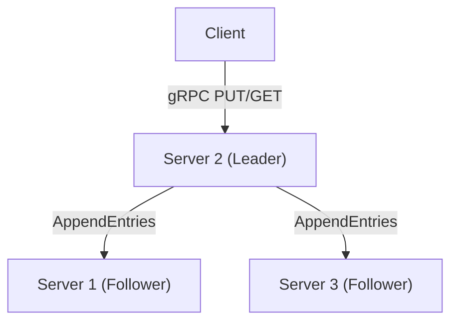
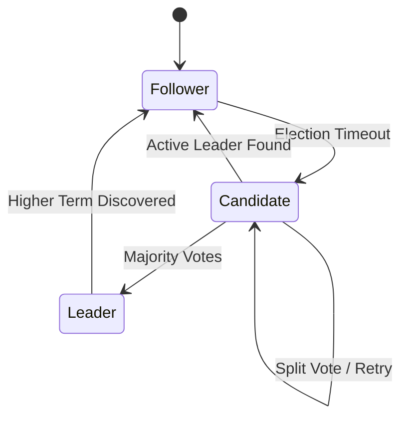
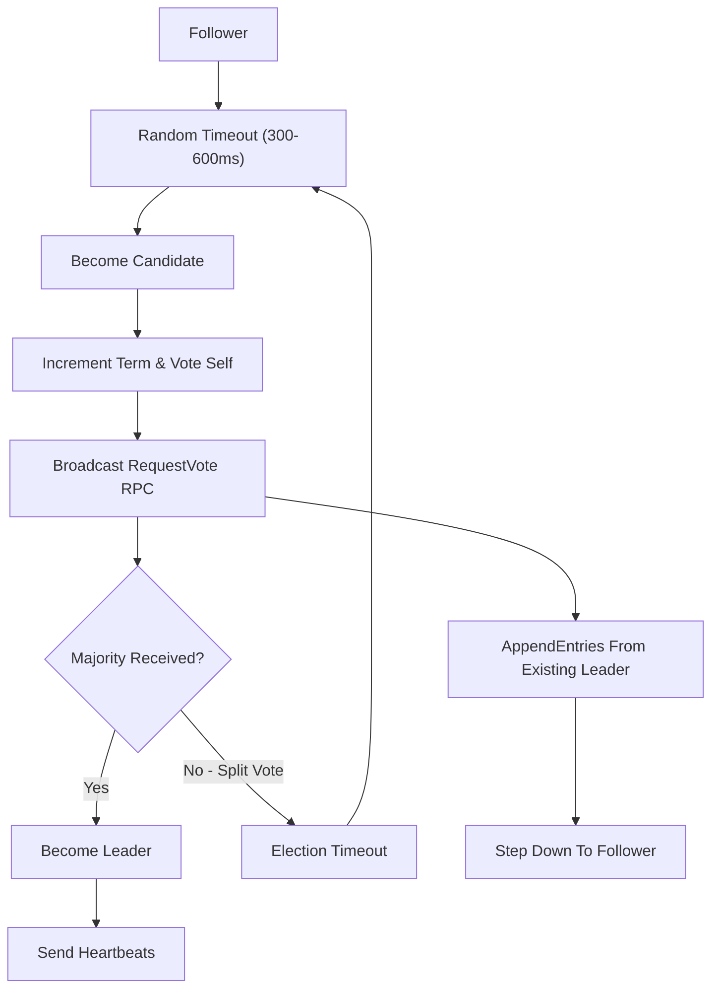
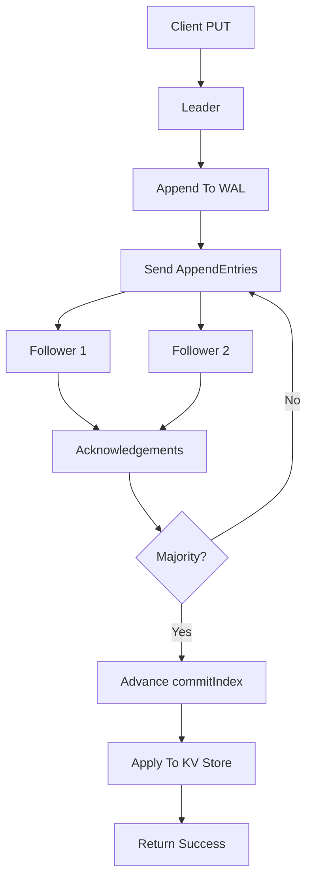
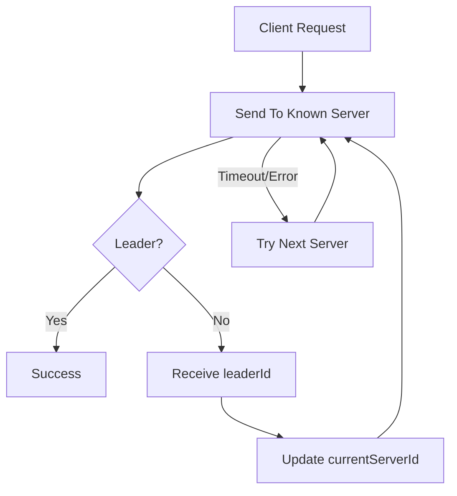
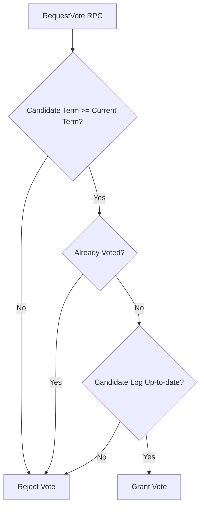
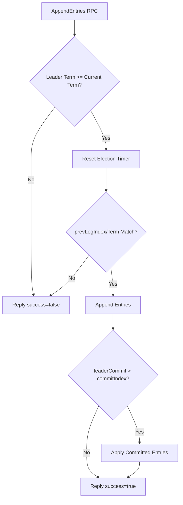
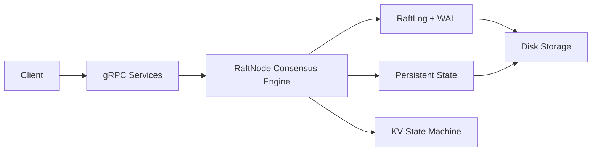

# raft-kv-java

A distributed, fault-tolerant key-value store built in Java 21, implementing the **Raft consensus algorithm** for leader election and log replication. It uses gRPC for high-performance inter-node communication and client operations, with durable state persistence and structured logging.


This project is structured as a multi-module Gradle project, strictly separating the core consensus algorithm from network and transport concerns. This architecture makes the Raft state machine 100% testable without any mock sockets or RPC channels.

---

## Architecture & Design Decisions

# 1. Cluster Topology



# 2. Raft State Transitions



# 3. Leader Election Flow



# 4. Log Replication Flow



# 5. Client Redirection Logic



# 6. Internal Vote Request Processing



# 7. AppendEntries Processing



# 8. Node Internal Architecture




### Key Components inside each Node

Each node runs inside its own JVM process (or container) and has four main layers:
1. **gRPC Server / Services**: Exposes the remote API contracts. The server listens on `NODE_PORT` for incoming consensus RPCs (`RaftService`) and client requests (`KVService`).
2. **RaftNode Consensus Engine**: The core state machine governing term counters (`currentTerm`), voting history (`votedFor`), cluster election timers, and peer replication indexes. It is completely isolated from network transport interfaces.
3. **RaftLog & Disk WAL**: Manages the append-only log entries in memory (for fast reads) and syncs them to stable storage on disk (for recovery) before responding to RPCs.
4. **State Machine Database (KV Map)**: A local `ConcurrentHashMap` holding the final committed state of the data. Follower queries (GETs) read from this database directly, while writes (PUTs) must be committed by Raft consensus before being executed.

---

### Step-by-Step Request Flow (PUT)

Here is how a write request flows through the architecture:
1. **Client Submission**: The `RaftCliClient` sends a `PutRequest` over gRPC to what it believes is the leader (e.g. Node 1).
2. **Leadership Check**: If Node 1 is not the leader, it replies with `success=false` and points to the current leader's ID. The client automatically reconnects and redirects the request. If Node 1 is the leader, it accepts the write.
3. **Log Append**: The leader calls `RaftNode.clientWrite()`, appending the command (e.g. `PUT key value`) to its `RaftLog` (saved to disk).
4. **Replication Broadcast**: The leader's consensus engine broadcasts `AppendEntries` RPCs containing the new log entry to all peer nodes (Node 2 and Node 3) in parallel.
5. **Follower Acknowledgment**: Followers receive the entry, perform consistency checks, write it to their own disk logs, and return `success=true` to the leader.
6. **Quorum Commit**: Once the leader receives positive acknowledgments from a majority of nodes (quorum), it updates its `commitIndex` and calls `applyLogEntries()`.
7. **Database Apply & Client Reply**: The leader applies the command to its local KV map, resolves the client's pending future, and returns a successful response to the client.
8. **Follower Apply**: On the next heartbeat cycle, followers learn of the updated `commitIndex`, run the command on their local database maps, and advance their `lastApplied` index.

---

### Module Breakdown
- **`raft-core`**: Contains the pure Raft state machine (`RaftNode`), log management (`RaftLog`), and state storage (`PersistentState`). Has **zero** networking dependencies (no gRPC, no HTTP). It coordinates operations asynchronously via the `RaftNodeListener` interface.
- **`raft-rpc`**: Holds the Protocol Buffer contracts (`raft.proto`) and generated gRPC base services (`RaftServiceImpl`, `KVServiceImpl`).
- **`raft-server`**: The executable node orchestrator. It parses CLI/env configs (`ClusterConfig`), boots the gRPC server, instantiates peer client stubs (`PeerClient`), and wires the core `RaftNode` state machine to the transport layer.
- **`raft-client`**: A simple, interactive command-line client (`RaftCliClient`) for running GET/PUT operations on the cluster, featuring automatic leader redirection and server failover.

---

## Core Features & Safety Rules Implemented
- **Leader Election**: Randomized election timeouts (default 300–600ms) prevent split-vote cycles. Election safety is guaranteed by comparing last log terms and indices during voting.
- **Log Replication**: Outbound `AppendEntries` heartbeats sync logs. Follower mismatch replication conflicts are auto-corrected by backing off nextIndex.
- **Quorum Commits**: The leader only advances the `commitIndex` once an entry is replicated to a majority of nodes. To prevent old-term anomalies (Figure 8 in Raft paper), the leader only commits logs of its *current term* directly.
- **State Persistence**: Durability is guaranteed by writing the log and term metadata (`currentTerm`, `votedFor`) to disk. Safe file operations utilize a temp file and `java.nio.file.Files.move` with `ATOMIC_MOVE` to prevent file corruption during middle-of-write crashes.
- **Client Redirection & Failover**: Non-leader nodes redirect clients to the current leader. The client CLI automatically catches redirects and retries against the correct node.
- **Structured Logging**: Mapped Diagnostic Context (`MDC`) prints the current node ID and term with every log message, enabling clean multi-process cluster debugging.

---

## Getting Started

### Prerequisites
- **Java 21 (LTS)**
- **Docker** and **Docker Compose**

### Running with Docker Compose (Recommended)
You can spin up a 3-node cluster with one command. This builds the project inside a Gradle container first, then boots 3 slim containers connected on a bridge network.

```bash
# Start the cluster
docker-compose -f docker/docker-compose.yml up --build
```

Host port mapping:
- **Node 1**: `localhost:8001`
- **Node 2**: `localhost:8002`
- **Node 3**: `localhost:8003`

You will see logs detailing the election timeouts, candidate votes, and leader heartbeats:
```text
10:29:47.123 [main] INFO - [Node-1] RaftNode - Starting node 1 in state FOLLOWER
10:29:47.452 [scheduler-1] INFO - [Node-1] RaftNode - Election timeout on node 1, term 0, transitioning to CANDIDATE
10:29:47.453 [scheduler-1] INFO - [Node-1] RaftNode - Node 1 starting election for term 1
10:29:47.490 [main] INFO - [Node-1] RaftNode - Node 1 elected LEADER for term 1
```

---

## Using the CLI Client

The CLI client communicates with the cluster via gRPC. It loops through all servers, follows redirects, and retries other nodes if the current target fails.

Run the client using the pre-compiled Gradle task or command line:

```bash
# Syntax: ./gradlew :raft-client:run --args="<cluster-servers> <operation> <key> [value]"

# 1. Write a key-value pair to the cluster (will auto-route/redirect to the elected leader)
./gradlew :raft-client:run --args="1=localhost:8001,2=localhost:8002,3=localhost:8003 put mykey myvalue"

# 2. Read the key-value pair
./gradlew :raft-client:run --args="1=localhost:8001,2=localhost:8002,3=localhost:8003 get mykey"
```

Output:
```text
Sending PUT mykey=myvalue to Node 1...
REDIRECT: Node 1 is not the leader. Redirecting to Leader Node 2...
Sending PUT mykey=myvalue to Node 2...
SUCCESS: Put completed successfully.
```

---

## Testing

### Core Unit Tests
Test the core algorithm offline (e.g. mock timeouts and transitions with no network involved):
```bash
./gradlew :raft-core:test
```

---

## Key Configurations

Configurations can be customized via environment variables:

| Variable | Default | Description |
|---|---|---|
| `NODE_ID` | `1` | Numeric ID of the node |
| `NODE_PORT` | `8001` | gRPC server listening port |
| `PEERS` | *None* | Comma-separated peer list `nodeId=host:port` |
| `ELECTION_TIMEOUT_MIN_MS` | `300` | Minimum election timeout |
| `ELECTION_TIMEOUT_MAX_MS` | `600` | Maximum election timeout |
| `HEARTBEAT_INTERVAL_MS` | `50` | Heartbeat interval (AppendEntries rate) |
| `DATA_DIR` | `data/node<id>` | Local persistent state directory |
